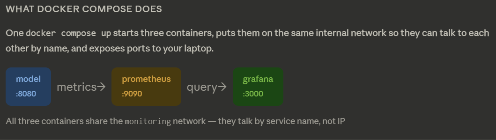

<h1 align=center> ML-Monitoring (Prometheus+Grafana) </h1>

## 1 ML model + local API

```bash
Train, serve, and test the model locally — everything works before adding infrastructure
train.py  | FastAPI  | Pydantic v2  | Prometheus metrics  | pytest 18/18  | uv / venv  | smoke test
```

### Steps

```bash
- Define structure
- Add pyproject.toml, requirements.txt and create venv
- Add code to train.py
- Add code to core/config.py and core/logging.py
- Add code to ml/schemas.py and ml/predictor.py
- add code to monitoring/metrics.py
- Add code to api/health.py and api/predict.py
- Define main.py
- Add code to tests/conftest.py, tests/test_api.py and tests/test_predictor.py
```

### How To Run

```bash
# 1. Create the folder structure
mkdir -p heart-disease-mlops/model/app/{api,core,ml,monitoring}
mkdir -p heart-disease-mlops/model/tests

# 2. Copy each file above into its path

# 3. Create empty __init__.py files
touch heart-disease-mlops/model/app/__init__.py
touch heart-disease-mlops/model/app/api/__init__.py
touch heart-disease-mlops/model/app/core/__init__.py
touch heart-disease-mlops/model/app/ml/__init__.py
touch heart-disease-mlops/model/app/monitoring/__init__.py
touch heart-disease-mlops/model/tests/__init__.py

# 4. Install dependencies
cd heart-disease-mlops/model
pip install -r requirements.txt
pip install pytest httpx  # test-only deps

# 5. Train the model
python train.py

# 6. Run tests (from project root)
cd ..
python -m pytest model/tests/ -v

# 7. Start the API
cd model
uvicorn app.main:app --reload --port 8080

# 8. Try it
curl http://localhost:8080/health
curl http://localhost:8080/docs        # Swagger UI
curl http://localhost:8080/metrics     # Prometheus output
curl -X POST http://localhost:8080/predict \
  -H "Content-Type: application/json" \
  -d '{"age":63,"sex":1,"cp":3,"trestbps":145,"chol":233,"fbs":1,"restecg":0,"thalach":150,"exang":0,"oldpeak":2.3,"slope":0,"ca":0,"thal":1}'

```

---

---

## 2 Docker

```bash
Containerise the service — multi-stage build, non-root user, local run + verify
Dockerfile  | multi-stage build  | docker compose  | HEALTHCHECK  | layer caching
```

### files

```bash
heart-disease-mlops/
├── model/
│   └── Dockerfile           ← multi-stage build
├── docker-compose.yml       ← run everything locally with one command
├── docker-compose.override.yml  ← dev overrides (hot reload, mounts)
├── .dockerignore            ← keep images lean
└── .env.example             ← document all env vars
```

### steps

```bash
- Add Dockerfile
- Add .dockerignore
- Add docker-compose.yml and docker-compose.override.yml
- Add monitoring/prometheus.yml, monitoring/grafana/provisioning/datasources/prometheus.yml and monitoring/grafana/provisioning/dashboards/default.yml
- Add dashboards/model.json
- Add .env.example
- Update gitignore

```

### How To Run

```bash
# From heart-disease-mlops/ root

# ── Option A: production mode (full build — trains model inside Docker) ───────
docker compose -f docker-compose.yml up --build

# ── Option B: dev mode (hot reload, uses your local .pkl) ─────────────────────
# First make sure you have already run: cd model && python train.py
docker compose up --build

# ── Verify everything is running ──────────────────────────────────────────────
docker compose ps
# model       → running  (port 8080)
# prometheus  → running  (port 9090)
# grafana     → running  (port 3000)

# ── Test the API inside Docker ────────────────────────────────────────────────
curl http://localhost:8080/health
curl http://localhost:8080/metrics
curl -X POST http://localhost:8080/predict \
  -H "Content-Type: application/json" \
  -d '{"age":63,"sex":1,"cp":3,"trestbps":145,"chol":233,"fbs":1,
       "restecg":0,"thalach":150,"exang":0,"oldpeak":2.3,
       "slope":0,"ca":0,"thal":1}'

# ── Open Grafana ──────────────────────────────────────────────────────────────
open http://localhost:3000   # admin / admin

# ── Check Prometheus scraped the model ────────────────────────────────────────
open http://localhost:9090/targets
# Should show: heart-disease-model → UP

# ── Stop everything ───────────────────────────────────────────────────────────
docker compose down

# ── Stop and remove volumes (wipe Prometheus + Grafana data) ──────────────────
docker compose down -v
```

`Phase 2 in one sentence: Package the Phase 1 model into Docker so it runs identically anywhere, then use docker compose to start it alongside Prometheus (metrics collector) and Grafana (dashboard) with one command.`

### The three things you actually need to understand:

- Dockerfile has two stages. Stage 1 is a throwaway — it installs heavy libraries and trains the model. Stage 2 is what ships to production — it only has the model file and the serving code. The final image is lean and secure because it never contains training code or raw data.
- docker-compose.yml is the glue. It starts all three containers on the same internal network so Prometheus can reach the model by typing model:80 (the service name), and Grafana can reach Prometheus by typing prometheus:9090. You only expose ports 8080, 9090, and 3000 to your laptop.
- docker-compose.override.yml is dev mode. Docker automatically merges it when you run docker compose up. It mounts your source code as a live volume and enables --reload, so you save a file and the change is immediately live inside the container. Skip it with docker compose -f docker-compose.yml up when you want production behaviour.

### The one command to remember:

```bash
cd model && python train.py   # generate model.pkl first
cd ..
docker compose up --build     # starts everything
```

- Then open localhost:8080/docs to test the API, localhost:9090/targets to confirm Prometheus is scraping, and localhost:3000 for Grafana (admin / admin).

## 

---

## 3 Kubernetes

```bash
Deploy to minikube — Deployment, Service, HPA, liveness/readiness/startup probes
minikube  | kubectl  | Deployment  | Service  | HPA  | probes  | namespaces
```

### Added files

```bash
heart-disease-mlops/
└── k8s/
    ├── namespace.yaml
    ├── model/
    │   ├── deployment.yaml
    │   ├── service.yaml
    │   ├── hpa.yaml
    │   └── service_monitor.yaml
    └── scripts/
        ├── setup.sh        ← one-shot cluster bootstrap
        └── smoke_test.sh   ← post-deploy validation
```

### Hot To Run

```bash
# Make scripts executable
chmod +x k8s/scripts/setup.sh
chmod +x k8s/scripts/smoke_test.sh

# ── One-shot bootstrap (does everything) ──────────────────────────────────────
./k8s/scripts/setup.sh  # run in git bash

# ── Or step by step ───────────────────────────────────────────────────────────

# 1. Start minikube (4GB RAM, 4 CPU, 2 nodes)
minikube start --driver=docker --memory=4096 --cpus=4 --nodes=2
minikube addons enable metrics-server

# 2. Train locally, build image, load into minikube
cd model && python train.py && cd ..
docker build -t heart-disease-model:1.0.0 -f model/Dockerfile model/
minikube image load heart-disease-model:1.0.0

# 3. Apply manifests
kubectl apply -f k8s/namespace.yaml
kubectl apply -f k8s/model/deployment.yaml
kubectl apply -f k8s/model/service.yaml
kubectl apply -f k8s/model/hpa.yaml

# 4. Wait for pods to be ready
kubectl rollout status deployment/heart-disease-model -n model-serving --timeout=120s

# 5. Verify
kubectl get pods -n model-serving
kubectl get svc   -n model-serving
kubectl get hpa   -n model-serving

# 6. Port-forward and smoke test
kubectl port-forward svc/heart-disease-model 8080:80 -n model-serving &
sleep 2
./k8s/scripts/smoke_test.sh http://localhost:8080  # run in git bash

# 7. Useful debug commands
kubectl describe pod -l app=heart-disease-model -n model-serving
kubectl logs -l app=heart-disease-model -n model-serving -f
kubectl get events -n model-serving --sort-by='.lastTimestamp'
```

### Key things to understand in Phase 3

- Three probes and why each exists — startup probe gives the model time to load (up to 60s) before K8s starts checking. Readiness probe removes the pod from traffic if it becomes unhealthy without restarting it. Liveness probe restarts the pod if it becomes completely unresponsive. Without startup probe, liveness kills the pod before the model finishes loading.
- maxUnavailable: 0 — the rolling update never terminates an old pod until a new one passes readiness. Zero downtime, guaranteed.
- minikube image load — minikube runs its own Docker daemon separate from your laptop's. Building an image on your host doesn't make it available inside minikube. This command copies it across.
- ServiceMonitor namespace — the manifest lives in monitoring not model-serving. This is intentional. The Prometheus Operator watches for ServiceMonitors in its own namespace, then scrapes whatever namespaces the namespaceSelector points to.
- release: prometheus-stack label — this is the critical wiring between the ServiceMonitor and Prometheus. If this label doesn't match what Helm set on the Prometheus CR, Prometheus silently ignores the ServiceMonitor. In Phase 4 we verify this is correct.

---

---
